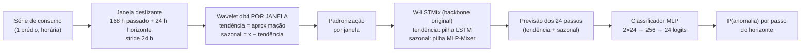

# Sumé — Aprendizado Federado para Classificação de Anomalias com Dados Non-IID no Contexto Elétrico

Código da dissertação de mestrado **"Aplicação de Aprendizado Federado para classificação de anomalias com dados Non-IID no Contexto Elétrico"**.

## Objetivo

Comparar o desempenho do algoritmo **Sumé** treinado em duas arquiteturas — **federada** (Flower, com Raspberry Pi 5 como clientes) e **centralizada** — na **classificação binária de anomalias** em séries de consumo de energia elétrica, com dados **Non-IID** (cada cliente detém os dados de países diferentes do [EnergyBench](https://huggingface.co/datasets/ai-iot/EnergyBench)).

O Sumé **não é uma extensão de forecasting** do [W-LSTMix](https://github.com/EdgeIntelligenceLab/W-LSTMix): é uma reformulação para **classificação em *near-real time***. A estrutura do W-LSTMix é aproveitada como bloco de previsão, e **ao final dela existe um classificador**, que decide, ponto a ponto, se o dado é anômalo — é a saída desse classificador que gera as métricas de avaliação (matriz de confusão, recall, AUC-ROC, PR-AUC).

---

## Como o Sumé funciona



| Etapa | O que acontece | Onde |
|---|---|---|
| Janelamento | 168 passos de entrada (*backcast*) + 24 de horizonte, deslizando 24 passos (janelas sobrepostas) | `scripts/step2_3_windows_wavelet.py` |
| Decomposição | `pywt.wavedec` (db4, nível ≤ 5) **dentro de cada janela**: a tendência é a reconstrução só com os coeficientes de aproximação; o sazonal é o resto | `scripts/step2_3_windows_wavelet.py` |
| Rótulos | Bicaudal e **intra-janela**: ponto anômalo se o resíduo `x − tendência` < quantil 1% ou > quantil 99% da própria janela; depois, fusão `any` entre as janelas que cobrem o mesmo instante | `scripts/step4_5_labels.py` |
| Modelo | `HybridWLSTMix` = `models/W_LSTMix.py` **inalterado** + cabeça de classificação | `scripts/model_hybrid.py` |
| Perda | previsão (MSE de tendência e sazonal, balanceadas entre si) + `λ · BCE` da classificação (λ = 1) | `scripts/step6_train.py::run_epoch` |
| Teste | os shards de teste **não** carregam rótulos: eles são gerados no momento da avaliação, pelas **mesmas funções** do treino | `task.py::evaluate` |

A cadeia de pré-processamento foi desenhada para não vazar informação do teste: o corte treino/teste (85%/15%, cronológico por prédio) é a primeira operação; nenhuma estatística atravessa janelas; e o rótulo do teste só existe em tempo de avaliação.

Hiperparâmetros centrais (janela, wavelet, quantis, regra de fusão, lote, λ, arquitetura do backbone) ficam em **`scripts/config.py`**, lido por todos os passos e por todos os nós — servidor e clientes usam, por construção, a mesma configuração.

---

## Desenho experimental

### Dados e partição Non-IID

Perfis **reais** de carga do EnergyBench, resolução **horária**, setores Comercial e Residencial: **59 de 67 subconjuntos** (8 não estavam disponíveis), de **25 países**. A atribuição país → cliente é fixa e auditável em `scripts/country_map.py`:

| Cliente | Países | Subconjuntos |
|---|---|---|
| Pi 1 | Espanha | 1 |
| Pi 2 | Austrália | 3 |
| Pi 3 | Reino Unido | 4 |
| Pi 4 | EUA, China, Eslováquia, Alemanha, Canadá, Itália/Áustria, Japão, Irlanda, Suíça, México, Malásia | 29 |
| Pi 5 | Noruega, Portugal, Sri Lanka, Índia, Tailândia, África do Sul, Coreia do Sul, Grécia, França, Emirados Árabes, Costa Rica | 22 |

O perfil **sintético** do EnergyBench é usado apenas no pré-treino de um dos pontos de partida (v0, abaixo).

### Ponto de partida comum (v0)

Antes dos cenários, um modelo inicial é treinado no **servidor (GPU)** com `scripts/step6_train.py`:

- **`v0_real`** — só dados reais;
- **`v0_final`** (real + sintético) — pré-treino no sintético + ajuste no real.

### Cenários

| Cenário | Arquitetura | Parte de | Treino | Script |
|---|---|---|---|---|
| **I** | Centralizada | `v0_real` | Pi 1 (Espanha), local | `scripts/train_local_pi.py` |
| **II** | Federada (FedAvg, 5 Pis) | `v0_real` | 5 partições Non-IID | `server_app.py` / `client_app.py` |
| **III** | Centralizada | `v0_final` | Pi 1 (Espanha), local | `scripts/train_local_pi.py` |
| **IV** | Federada (FedAvg, 5 Pis) | `v0_final` | 5 partições Non-IID | `server_app.py` / `client_app.py` |

### Protocolo de avaliação (igual para os 4 cenários)

Todos os checkpoints passam pelo **mesmo código** (`eval_auc.py`, que chama `task.evaluate`): teste das **5 partições**, **15 shards por partição** (amostragem determinística), rótulos gerados em tempo de avaliação, score contínuo por ponto. O número comparado entre arquiteturas é o **AUC pooled** (sobre a união dos pontos), pois AUC não é aditivo — a média de AUCs por cliente que o FedAvg registra serve só para acompanhar as rodadas. `analysis/montar_resultados.py` confere que os quatro cenários foram avaliados exatamente nos mesmos pontos (vetor de rótulos byte-idêntico).

---

## Resultados de referência

Fonte: `analysis/plot_matriz_confusao.py` (saída do `montar_resultados.py`). 78.809.400 pontos de teste, prevalência de anomalias de 5,43%, limiar 0,5.

| Cenário | AUC-ROC | PR-AUC | Recall | Precisão | F1 | Acurácia |
|---|---|---|---|---|---|---|
| I — Centralizado / Real | 0,8525 | 0,3035 | 0,1277 | 0,5086 | 0,2041 | 0,9459 |
| II — Federado / Real | 0,8532 | 0,2978 | 0,8613 | 0,1312 | 0,2277 | 0,6826 |
| III — Centralizado / Real + Sintético | 0,8505 | 0,3016 | 0,1197 | 0,5162 | 0,1944 | 0,9461 |
| IV — Federado / Real + Sintético | 0,8532 | 0,2977 | 0,8530 | 0,1338 | 0,2313 | 0,6921 |

A acurácia deve ser lida contra a linha de base da classe majoritária (**0,9457**: um modelo que sempre responde "normal"). As métricas que dependem do limiar (recall, precisão, acurácia) são sensíveis à configuração da BCE de cada caminho de treino — ver [Configuração efetiva dos cenários](#configuração-efetiva-dos-cenários).

---

## Estrutura do repositório

```
Sume-Masters/
├── README.md
├── .env.example              # modelo do .env (caminhos dos dados) — copiar para .env
├── pyproject.toml            # Flower App: componentes, run-config e federações
│
├── server_app.py             # ┐ Flower App (precisa ficar na raiz: o pyproject
├── client_app.py             # │ referencia "server_app:app" e "client_app:app")
├── strategy.py               # │ FedAvg + TensorBoard + melhor checkpoint global
├── task.py                   # ┘ treino/avaliação locais de cada cliente
├── eval_auc.py               # avaliação post-hoc padronizada (federado E centralizado)
├── smoke_test_fed.sh         # orquestra o federado: superlink, supernodes, run, collect, auc
│
├── models/W_LSTMix.py        # backbone do W-LSTMix, original e inalterado
├── my_utils/metrics.py       # métricas de forecasting do paper (CVRMSE, NRMSE, MAE, MSE)
│
├── scripts/                  # pipeline de dados + treino centralizado
│   ├── config.py             # configuração central (lida por todos os passos e nós)
│   ├── country_map.py        # subconjunto → país → Pi (partição Non-IID)
│   ├── model_hybrid.py       # HybridWLSTMix = W-LSTMix + classificador
│   ├── step1_split.py        # 1. EnergyBench bruto → 1 parquet por prédio + split treino/teste
│   ├── step2_3_windows_wavelet.py  # 2-3. janelas + wavelet por janela → shards .pt
│   ├── step4_5_labels.py     # 4-5. rótulos bicaudais + fusão → labels_fused nos shards
│   ├── step6_train.py        # 6. treino dos v0 no servidor (e --mode test)
│   ├── train_local_pi.py     # cenários I e III: treino centralizado no Pi
│   ├── perf_log.py           # log de execução e recursos dos passos 1-6
│   ├── fed_monitor.py        # monitor de tempo/CPU/RAM/loss dos clientes
│   ├── smoke_report.py       # consolida o smoke test e estima o tempo do run completo
│   ├── analyze_log.py        # diagnóstico dos logs do perf_log
│   ├── figuras/              # inspeção visual dos artefatos de cada passo
│   └── EDA/                  # análise exploratória do EnergyBench (ver README_EDA.md)
│
├── analysis/                 # consolidação dos resultados da dissertação
│   ├── montar_resultados.py  # junta e CONFERE as avaliações dos 4 cenários
│   ├── collect_results.py    # métricas por rodada a partir dos logs do Flower
│   ├── plot_matriz_confusao.py
│   └── plot_loss.py          # curvas de loss (SVG/PDF/PGF + CSV)
│
├── setup/                    # ambiente
│   ├── config_rasp.sh        # prepara um Raspberry Pi (clone + venv + dependências)
│   ├── check_pi_config.py    # testa as dependências do cliente no Pi
│   ├── requirements_pi.txt
│   └── requirements_server.txt
│
├── checkpoints/W_LSTMix/     # pesos do W-LSTMix original (forecasting)
└── doc/                      # figuras da arquitetura do W-LSTMix original
```

**Convenção de execução:** tudo roda **a partir da raiz do repositório**. Os módulos de `scripts/` importam uns aos outros como `scripts.<módulo>`, então são chamados com `python -m scripts.<módulo>` (exceto `scripts/train_local_pi.py`, que ajusta o próprio `sys.path`).

---

## Infraestrutura e instalação

Usada nos experimentos: **1 servidor** (agregador Flower e treino dos v0, GPU NVIDIA) + **5 Raspberry Pi 5** (clientes), na mesma rede local, **sem TLS** (rede fechada — decisão registrada em `server_app.py`), com os dados num **storage compartilhado (TrueNAS)** montado em todos os nós. Como os 5 Pis enxergam o mesmo storage, a partição de cada cliente vem do parâmetro `pi=N` de cada SuperNode (resolvido por `country_map.py`), **não** do caminho dos dados.

**Servidor**

```bash
git clone https://github.com/umjourje/Sume-Masters.git && cd Sume-Masters
python3 -m venv ../314-env && source ../314-env/bin/activate
pip install -r setup/requirements_server.txt
pip install "flwr==1.33.0" tensorboard seaborn   # ver nota abaixo
cp .env.example .env                             # e ajuste os caminhos
```

> ⚠️ `setup/requirements_server.txt` é um `pip freeze` de agosto/2026 e **não inclui** `flwr`, `tensorboard` e `seaborn`, que o servidor usa (`server_app.py`, `strategy.py`, `analysis/plot_matriz_confusao.py`). A versão do Flower deve ser **a mesma dos Pis** (1.33.0). `geopandas` e `plotly` são necessários apenas para os mapas de `scripts/EDA/`.

**Cada Raspberry Pi**

```bash
bash setup/config_rasp.sh     # clona em ~/source/Sume-Masters, cria ~/source/<XY>-env e testa o ambiente
cp ~/source/Sume-Masters/.env.example ~/source/Sume-Masters/.env   # e ajuste
```

**`.env`** (servidor e Pis): `scripts/config.py` exige `RAW_ROOT` e `OUT_ROOT` ao ser importado — inclusive pelo `task.py` dos clientes. Veja os comentários em `.env.example`.

> Servidor e Pis precisam estar **no mesmo commit**: o Flower empacota o app a partir do servidor, mas o `task.py` dos clientes importa `scripts/` do clone local de cada Pi.

---

## Reprodução passo a passo

Caminhos usados nos experimentos (ajuste aos seus):

```bash
REAL=/mnt/juliana-truenas/EnergyBench-Anomaly          # saída do pipeline sobre o real
SYNTH=/mnt/juliana-truenas/Synth-EnergyBench-Anomaly   # saída do pipeline sobre o sintético
```

### 0. Análise exploratória (opcional)

Ver `scripts/EDA/README_EDA.md`.

### 1–5. Preparação dos dados (servidor, uma vez por dataset)

Rode para o **real** (`.env`: `RAW_ROOT=.../Energy-Load-Profiles`, `OUT_ROOT=$REAL`) e depois para o **sintético** (`RAW_ROOT=.../Synthetic-Energy-Load-Profiles`, `OUT_ROOT=$SYNTH`):

```bash
python -m scripts.step1_split               # → $OUT_ROOT/01_splits/Hourly/{train,test}/<Setor>/<Grupo>/<prédio>.parquet
python -m scripts.step2_3_windows_wavelet   # → $OUT_ROOT/02_windows/Hourly/{train,test}/<Setor>/<Grupo>.wNN.partKKK.pt
python -m scripts.step4_5_labels            # rotula só o TREINO → labels_fused nos .pt + 03_labeled_series/
```

Todos são retomáveis após interrupção (`--fine-resume` nos passos 1 e 2-3; o 4-5 pula shards já rotulados) e aceitam `--group` para processar um subconjunto. Logs de execução e recursos vão para `$OUT_ROOT/logs/` (diagnóstico: `python -m scripts.analyze_log`).

Inspeção visual dos artefatos (menus interativos; `--list` para inventário):

```bash
python -m scripts.figuras.plot1_split          # série de um prédio com a fronteira real treino/teste (passo 1)
python -m scripts.figuras.plot2_decomposition  # decomposição armazenada + banda de anomalia q1/q99 (passos 2-4)
python -m scripts.figuras.plot3_windowing      # janelamento sobre a série rotulada e fundida (passos 4-5)
```

### 6. Treino dos v0 (servidor, GPU)

`.env`: `OUT_ROOT=$SYNTH` e `OUT_ROOT_REAL=$REAL` (os modelos são gravados em `$SYNTH/04_models/<tag>/best_model.pth`).

```bash
python -m scripts.step6_train --mode train --data-scope real --tag v0_real
python -m scripts.step6_train --mode train --data-scope both --combine pretrain --tag v0_final
```

> ❓ Não há registro no repositório de `--max-shards` e `--pretrained` usados nesses dois treinos. Se o backbone foi inicializado com `checkpoints/W_LSTMix/best_model.pth`, acrescente `--pretrained checkpoints/W_LSTMix/best_model.pth`.

### Cenários I e III — centralizado (no Pi 1)

```bash
cd ~/source/Sume-Masters
python3 scripts/train_local_pi.py \
    --windows-root $REAL/02_windows/Hourly --pi 1 \
    --init-checkpoint $SYNTH/04_models/v0_real/best_model.pth \
    --max-shards 15 --tag pi1_esp_v0real --outdir ~/runs_central/real \
    --cache-gb 8 --cache-dir /var/tmp/shard_cache
# Cenário III: --init-checkpoint $SYNTH/04_models/v0_final/best_model.pth \
#              --tag pi1_esp_v0both --outdir ~/runs_central/real_synth
```

Ao final do treino o script já roda a **avaliação padronizada** (`eval_auc.avaliar`) nas 5 partições com 15 shards cada (`--eval-pis`, `--eval-max-shards`). Saídas em `<outdir>/<tag>/` (`best_local.pth`, `auc/<tag>/…`). `--eval-only` refaz só a avaliação.

> ⚠️ Registre aqui `--epochs`, `--patience` e `--lr` efetivamente usados (padrões do script: 100, 10 e 1e-4). Os runs de referência pararam em 7 (I) e 10 (III) épocas.

### Cenários II e IV — federado

Ajuste o bloco `AJUSTE AQUI` de `smoke_test_fed.sh` (IP do servidor, aliases SSH `pi1`…`pi5` no `~/.ssh/config`, caminhos dos venvs e dos dados) ou exporte as variáveis correspondentes. Variáveis do script vão **sempre em maiúsculas**.

```bash
# terminal 1 (servidor) — fica aberto
./smoke_test_fed.sh superlink

# terminal 2 (servidor)
./smoke_test_fed.sh preflight      # confere shards por Pi, binários do Flower e o v0 com strict=True
./smoke_test_fed.sh supernodes     # sobe 1 SuperNode por Pi com pi=1..5 (e mata órfãos antes)
./smoke_test_fed.sh status         # porta + processo + log de cada Pi

# smoke test (2 shards, 1 rodada) — mede o tempo para dimensionar o prazo das rodadas
TAG=smoke ROUND_TIMEOUT_S=3600 ./smoke_test_fed.sh run
TAG=smoke ./smoke_test_fed.sh collect && TAG=smoke ./smoke_test_fed.sh report

# run completo — Cenário II
TAG=full_real V0_PATH=$SYNTH/04_models/v0_real/best_model.pth MAX_SHARDS=15 \
  ROUNDS=<R> LOCAL_EPOCHS=<E> PATIENCE=<P> ROUND_TIMEOUT_S=<s> ./smoke_test_fed.sh run
TAG=full_real ./smoke_test_fed.sh collect
mv best_model_global.pth best_model_global_full_real.pth   # o servidor SOBRESCREVE esse arquivo a cada run

# Cenário IV: o mesmo, com TAG=full_both e V0_PATH=$SYNTH/04_models/v0_final/best_model.pth
```

- `ROUND_TIMEOUT_S` é **obrigatório**: resposta de cliente que chega depois do prazo é descartada em silêncio pelo Flower, e o FedAvg agrega só quem respondeu. Use 1,5–2× o tempo medido do Pi mais lento.
- `ROUNDS`, `LOCAL_EPOCHS` e `PATIENCE` dos runs de referência não estão registrados no repositório — ⚠️ preencha-os aqui.
- Acompanhamento: `./smoke_test_fed.sh progress pi1`, `./smoke_test_fed.sh logs <run-id>` e `tensorboard --logdir tb_logs/server`.
- Saídas no servidor: `best_model_global.pth` (melhor rodada por `test_loss`), `final_model_global.pth`, `run_summary_<TAG>.json`, `server_run_<TAG>.log`, `metrics_<TAG>/<pi>/`.

### Avaliação post-hoc dos checkpoints federados

```bash
TAG=full_real MAX_SHARDS=15 CKPT=best_model_global_full_real.pth ./smoke_test_fed.sh auc
TAG=full_both MAX_SHARDS=15 CKPT=best_model_global_full_both.pth ./smoke_test_fed.sh auc
# → metrics_<TAG>/auc/<TAG>/ (scores_pi<N>.npz, confusion_matrix_*, auc_<TAG>.json)
```

### Consolidação e figuras

```bash
python analysis/montar_resultados.py \
    --cen cen1=runs_central/real/pi1_esp_v0real \
    --cen cen2=metrics_full_real/auc/full_real \
    --cen cen3=runs_central/real_synth/pi1_esp_v0both \
    --cen cen4=metrics_full_both/auc/full_both \
    --fed-cm "cen2=metrics_full_real/pi*/confusion_matrix_full_real.json" \
    --fed-cm "cen4=metrics_full_both/pi*/confusion_matrix_full_both.json" \
    --out resultados_matrizes.json
# sai com código 1 se qualquer conferência falhar; imprime o dicionário data_input

python analysis/plot_matriz_confusao.py        # cole o data_input e escolha `cenario` no fim do arquivo
python analysis/plot_loss.py --inputs "metrics_full_real/*/loss_full_real*.jsonl" --out plots_full_real --fmt svg pdf
```

Os diretórios `runs_central/` são copiados do Pi 1 para o servidor antes desse passo.

---

## Configuração efetiva dos cenários

O que o código faz em cada caminho de treino, independentemente dos argumentos de linha de comando:

| | Centralizado (`train_local_pi.py`) | Federado (`task.py`) |
|---|---|---|
| Dados de treino | Pi 1 (Espanha), até 15 shards | 5 partições, até 15 shards cada |
| BCE | sem `pos_weight` | com `pos_weight` estimado (≈ negativos/positivos) |
| Taxa de aprendizado padrão | `--lr` 1e-4 | `lr` 0,001 (`pyproject.toml`) |
| Escolha do checkpoint | menor loss de validação (`--val-mode atual`) | menor `test_loss` agregado por rodada |

---

## Histórico

A reorganização de outubro/2026 removeu código que não participa do fluxo acima; tudo continua acessível no histórico do Git (último commit antes da limpeza: `62a6d09`):

- `train.py`, `test.py`, `finetune.py`, `configs/W_LSTMix.json`, `my_utils/tools.py`, `my_utils/decompose_normalize.py` e `checkpoints/W_LSTMix_finetune/` — W-LSTMix original de *forecasting*;
- primeira versão do pipeline (`step1_split.py`, `step2_3_windows_wavelet.py`, `step4_5_labels.py`, `step8_test.py`) — substituída pela versão `_v2`, que passou a ter o nome canônico;
- `plot2_decomposition.py` antigo — substituído pelo `plot2_AB_decomp.py` (figuras A e B), que passou a se chamar `scripts/figuras/plot2_decomposition.py`.

Implementação de referência anterior (com decomposição wavelet antes do split, motivadora do desenho sem vazamento): [W-LSTMix-Anomaly-Detection](https://github.com/stepsbtw/W-LSTMix-Anomaly-Detection).

---

## Créditos e citação

O Sumé usa o backbone do W-LSTMix, os dados do EnergyBench e o framework [Flower](https://flower.ai). Ao usar este código, cite também o trabalho original:

```bibtex
@inproceedings{dwivedi2025wlstmix,
  title={W-{LSTM}ix: A Hybrid Modular Forecasting Framework for Trend and Pattern Learning in Short-Term Load Forecasting},
  author={Shivam Dwivedi and Anuj Kumar and Harish Kumar Saravanan and Pandarasamy Arjunan},
  booktitle={1st ICML Workshop on Foundation Models for Structured Data},
  year={2025},
  url={https://openreview.net/forum?id=bG04Z3Jioc}
}
```

Os datasets do EnergyBench são usados sob seus respectivos termos e licenças, exclusivamente para pesquisa acadêmica.
